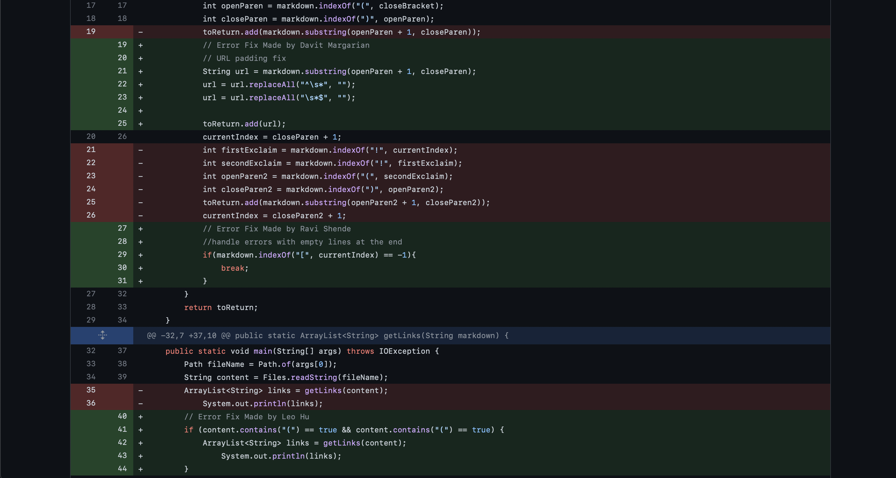
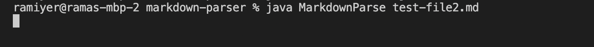
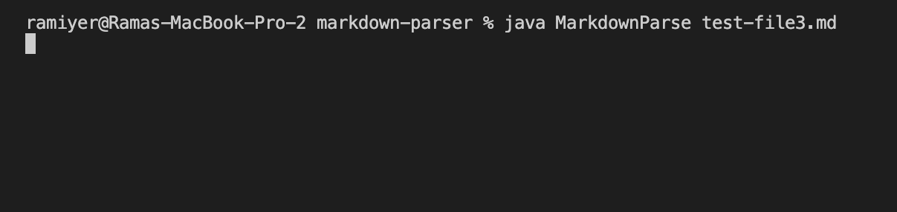
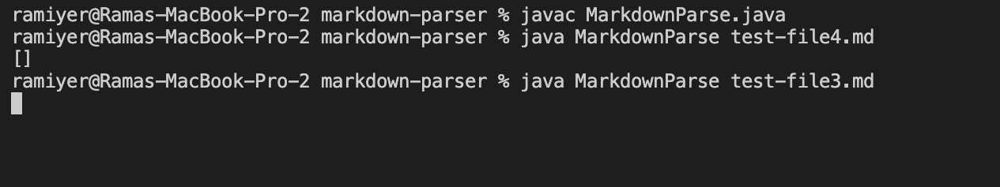

[Test File 1](https://github.com/adityaiyerr/markdown-parser/blob/main/test-file2.md)
[Test File 2](https://github.com/adityaiyerr/markdown-parser/blob/main/test-file3.md)
[Test File 3](https://github.com/adityaiyerr/markdown-parser/blob/main/test-file4.md)

